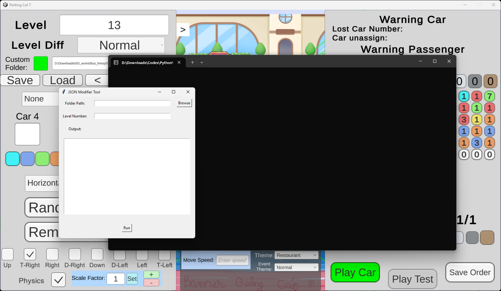

# Tool hỗ trợ tráo hàng khách bus out
# Hướng dẫn sử dụng:

### Bước 1:

- Tải file exe về, chạy file, sẽ thấy mở ra terminal của máy và một giao diện như hình (không đóng terminal lại, nếu không tool cũng sẽ đóng)

## Bước 2: 
- Trong máy, sau khi xếp xong layout (thường xếp tầm 5+ màu), playcar xong, nhấn save order xong và save file level, mở giao diện tool hỗ trợ lên
- Nhập vào đường dẫn level (tương tự đường dẫn nhập vào tool xếp), số level định tráo hàng khách
- Nhấn nút run, kết quả hiển thị như hình
  

### Bước 3: 
- Kiểm tra thông tin total passenger/ có lỗi gì không giống ảnh
- Phần ô text output hiển thị id mã màu của từng passenger trong level -> không cần quan tâm
- Có thêm cửa số cluster size input pop up, hiện lên cho đến khi chia hết khách vào các cụm
- Tool cho phép chia hàng khách thành các cụm, mỗi cụm có số màu riêng biệt tùy vào user nhập khi được hỏi "Enter the number of colors to group into this cluster:". Nhập xong, nhấn enter sẽ hiển thị số khách chưa được group vào cluster -> cứ tiếp tục chia như vậy cho đến khi hết khách. Thường ban đầu level dễ sẽ chia thành các cluster 3 màu, giữa/ cuối level khó thì lồng 1 2 cluster 4 màu vào tăng thử thách...
- Việc chia các cụm này là chia từng khoảng n màu khác biệt liên tiếp trong hàng khách. Ví dụ cụm n = 3 có thể là đỏ, đỏ, vàng, đỏ, xanh, hoặc là đỏ, vàng, xanh, đỏ, vàng, đỏ, xanh...
  
### Bước 4:
- Sau khi chia hết khách vào các cụm, tiếp tục có cửa số Randomize Cluster pop up như hình
- Phần text output hiển thị số cluster đã hình thành
- Với mỗi cluster sẽ hiển thị số màu trong cluster đó, cùng với số khách trong cluster đó
- Cửa sổ này hiển thị cho từng cluster, hỏi user có muốn tráo ngẫu nhiên khách trong 1 cluster hay không
- Nhấn yes thì tráo, no thì giữ nguyên, cho đến khi đã quyết định cho hết các cluster
  

### Bước 5:
- Sau khi xong thì vào tool test, load level lên chơi thử xem đã đúng ý/ đúng mô tả chưa -> nếu chưa thì vào tool xếp tune lại thủ công cho phù hợp.
- Có thể xóa text trong ô text output cho đỡ rối như với các trình soạn văn bản thông thường
  
# Tạo độ khó:
- Level dễ thì các move đầu cứ playcar ít màu xe (ví dụ đi 10 xe, nhưng 10 xe đó chỉ xoay quanh 2 - 3 màu) -> đoạn đầu rất dễ đi
- Lúc chia cụm màu thì cứ chia cụm 3 màu là dễ nhất (nếu chia cụm 4 thì lúc tráo nhiều khả năng chỉ có 1 cách đi duy nhất, ko có chỗ cho user đi sai)
- Level khó có thể chia cụm kiểu 3 3 3 3 ... 4 3 3 (full cụm 3 nhưng đến đoạn gần cuối cho 1 cụm 4). Level thường cứ cho full 3, xong thích thì lúc tune lại tự chỉnh theo ý mình.
- Lúc tune level thì xếp lại cho hợp lý là xong
- Do chia cluster theo thứ tự play car -> đảm bảo chỉ cần đi đúng thứ tự như đã play car thì luôn chơi được level
-> Phụ thuộc vào cả cách play car và cách chia cụm mà tạo độ khó

# Lỗi tiềm năng/ hạn chế/ note:
- Trong tool xếp chưa lưu được id xe/ thứ tự xe đi -> xếp level khó nếu cần có thể tự nhớ thứ tự playcar, hoặc tự chơi theo cảm tính lúc vào tool test rồi tune lại theo flow chơi đó sẽ gần với cách user chơi hơn
### Một số trường hợp chạy script xong, load level ko lên thì là do lúc tráo hàng khách có lỗi, vậy nên khi chạy tool hỗ trợ nên giữ nguyên tool xếp, chỉ load level đã tráo khách ở tool test. Nếu có vấn đề gì mở tool xếp level nhấn save lại để lấy lại level lúc chưa tráo khách
